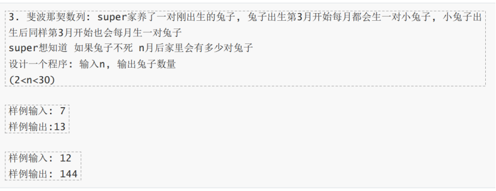

```c++
// 头文件

#ifndef PRINTSINGLEDIGIT_H
#define PRINTSINGLEDIGIT_H
#include <vector>

class singleDigit
{
public:
    static std::vector<int> digits(int num);
};

#endif //PRINTSINGLEDIGIT_H
```
```c++
// 源代码文件

#include "printSingleDigit.h"

#include <algorithm>

std::vector<int> singleDigit::digits(const int num)
{
    std::vector res = {0, 0, 0};
    int num_ = num;
    for (auto& digit : res)
    {
        digit = num_ % 10;
        num_ /= 10;
    }
    std::ranges::reverse(res);
    return res;
}
```
```c++
// 测试文件

#include <gtest/gtest.h>

#include "printSingleDigit.h"


class SingleDigitTest : public testing::Test {
};

// 测试数字 0
TEST_F(SingleDigitTest, TestZero) {
    const std::vector<int> result = singleDigit::digits(0);
    const std::vector expected = {0, 0, 0};
    EXPECT_EQ(result, expected);
}

// 测试数字 1-9
TEST_F(SingleDigitTest, TestSingleDigits) {
    for (int i = 1; i <= 9; ++i) {
        std::vector<int> result = singleDigit::digits(i);
        std::vector expected = {0, 0, i};  // 比如 5 -> {0, 0, 5}
        EXPECT_EQ(result, expected);
    }
}

// 测试两位数 10-99
TEST_F(SingleDigitTest, TestDoubleDigits) {
    for (int i = 10; i <= 99; ++i) {
        std::vector<int> result = singleDigit::digits(i);
        std::vector<int> expected = {0, i / 10, i % 10};  // 比如 34 -> {0, 3, 4}
        EXPECT_EQ(result, expected);
    }
}

// 测试三位数 100-999
TEST_F(SingleDigitTest, TestTripleDigits) {
    for (int i = 100; i <= 999; ++i) {
        std::vector<int> result = singleDigit::digits(i);
        std::vector expected = {i / 100, i / 10 % 10, i % 10};  // 比如 345 -> {3, 4, 5}
        EXPECT_EQ(result, expected);
    }
}
```
测试结果：


```c++
// 头文件

#ifndef SCORESEVAL_H
#define SCORESEVAL_H

class scoreSys
{
public:
    static int eval(int nums_correct);
};

#endif //SCORESEVAL_H
```
```c++
// 源代码文件

#include "scoresEval.h"

int scoreSys::eval(const int nums_correct)
{
    if (nums_correct >= 0 && nums_correct <= 10)
    {
        return nums_correct * 6;
    }
    if (nums_correct >= 11 && nums_correct <= 20)
    {
        return 10 * 6 + (nums_correct - 10) * 2;
    }
    return 10 * 6 + 10 * 2 + (nums_correct - 10 - 10) * 1;
}

```
```c++
// 测试文件

#include <gtest/gtest.h>
#include "scoresEval.h"

TEST(ScoreSysTest, EvalTest) {
    // Test nums_correct between 0 and 10
    EXPECT_EQ(scoreSys::eval(0), 0);  // 0 * 6 = 0
    EXPECT_EQ(scoreSys::eval(5), 30); // 5 * 6 = 30
    EXPECT_EQ(scoreSys::eval(10), 60); // 10 * 6 = 60

    // Test nums_correct between 11 and 20
    EXPECT_EQ(scoreSys::eval(11), 62); // 10 * 6 + 1 * 2 = 60 + 2 = 62
    EXPECT_EQ(scoreSys::eval(15), 70); // 10 * 6 + 5 * 2 = 60 + 10 = 70
    EXPECT_EQ(scoreSys::eval(20), 80); // 10 * 6 + 10 * 2 = 60 + 20 = 80

    // Test nums_correct between 21 and 40
    EXPECT_EQ(scoreSys::eval(21), 81); // 10 * 6 + 10 * 2 + 1 * 1 = 60 + 20 + 1 = 81
    EXPECT_EQ(scoreSys::eval(23), 83); // 10 * 6 + 10 * 2 + 1 * 1 = 60 + 20 + 3 = 83
    EXPECT_EQ(scoreSys::eval(30), 90); // 10 * 6 + 10 * 2 + 10 * 1 = 60 + 20 + 10 = 90
    EXPECT_EQ(scoreSys::eval(40), 100); // 10 * 6 + 10 * 2 + 20 * 1 = 60 + 20 + 20 = 100
}

```
测试结果：



```c++
// 头文件

#ifndef FIBONACCI_H
#define FIBONACCI_H

class fibonacci
{
public:
    static int eval(int n);
};

#endif //FIBONACCI_H

```
```c++
// 源代码文件

#include "fibonacci.h"

int fibonacci::eval(const int n)
{
    if (n == 0)
        return 0;
    if (n == 1)
        return 1;
    int f_n_minus_2 = 0;
    int f_n_minus_1 = 1;
    int f_n = 1;
    for (int i = 2; i <= n; i++)
    {
        f_n = f_n_minus_1 + f_n_minus_2;
        f_n_minus_2 = f_n_minus_1;
        f_n_minus_1 = f_n;
    }
    return f_n;
}

```

```c++
// 测试文件

#include <gtest/gtest.h>
#include "fibonacci.h"

TEST(FibonacciTest, HandlesRange3To29) {
    struct TestCase {
        int n;
        int expected;
    };
    TestCase testCases[] = {
        {3, 2},
        {4, 3},
        {5, 5},
        {6, 8},
        {7, 13},
        {8, 21},
        {9, 34},
        {10, 55},
        {11, 89},
        {12, 144},
        {13, 233},
        {14, 377},
        {15, 610},
        {16, 987},
        {17, 1597},
        {18, 2584},
        {19, 4181},
        {20, 6765},
        {21, 10946},
        {22, 17711},
        {23, 28657},
        {24, 46368},
        {25, 75025},
        {26, 121393},
        {27, 196418},
        {28, 317811},
        {29, 514229}
    };

    for (const auto& [n, expected] : testCases) {
        EXPECT_EQ(fibonacci::eval(n), expected)
            << "Failed at n = " << n;
    }
}

int main(int argc, char **argv) {
    testing::InitGoogleTest(&argc, argv);
    return RUN_ALL_TESTS();
}
```
测试结果：
